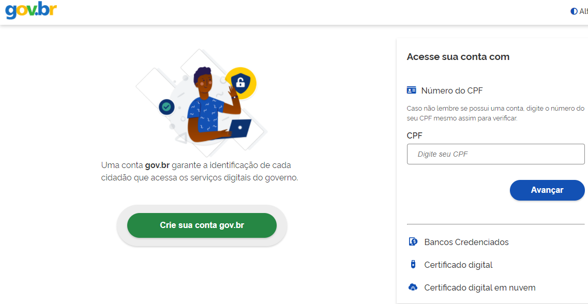

Não tenho cadastro no GoV.BR. Como devo fazer?
===================================

Passo 1 
**********************

Acesse https://acesso.gov.br/

Crie sua conta no Gov.BR
            

 
Passo 2
**********************

Obtenha a conta **verificada** (prata) **ou** conta **comprovada** (ouro)

Pessoa Física (CPF)
+++++++++++++++++++++

Na página do Gov.br, em "Minha Área", clique em "Privacidade" e **"Gerenciar lista de selos de confiabilidade"** e siga as instruções constantes em:

http://faq-login-unico.servicos.gov.br/en/latest/_perguntasdafaq/obtermaisconfiabilidadenacontadeacesso.html

Pessoa Jurídica (CNPJ)
+++++++++++++++++++++

Selecione a opção Certificado Digital ou Certificado Digital em Nuvem na tela inicial do https://acesso.gov.br e siga as instruções constantes em:

http://faq-login-unico.servicos.gov.br/en/latest/_perguntasdafaq/comocadastrarCNPJnologinunico.html

No momento da aquisição do selo você deverá estar com o *token* (*pen drive*) conectado ao computador ou certificado instalado. Certificados do tipo A1 e A3.

Mais informações sobre o Gov.BR podem ser obtidas no FAQ: https://faq-login-unico.servicos.gov.br/en/latest/

Colaborador de Pessoa Jurídica
+++++++++++++++++++++

A conta GoV.BR permite o cadastramento de pessoas que não pertencem diretamente a empresa. Esse cadastro ocorre com a vinculação de colaboradores.

Atenção:

O cidadão que realizará o cadastro do colaborador deverá ter cadastrado como Representante do CNPJ, conforme os passos para vinculação da empresa/CNPJ.

O colaborador deverá ter cadastro no Gov.BR

Siga as instruções constantes em:

http://faq-login-unico.servicos.gov.br/en/latest/_perguntasdafaq/cadastrocolaboradordocnpj.html

Passo 3
**********************
Cadastre-se na ANM
          
Acesse o Protocolo Digital: https://app.anm.gov.br/protocolo

+-----------------------------------+------------------------------------------------+
|  .. image:: ../imagens/portal.png | .. image:: ../imagens/Telaprotocolodigital.PNG |
+-----------------------------------+------------------------------------------------+

          
           
          
No primeiro acesso, preencha e salve os dados no Sistema de Dados Cadastrais (SDC).

Assim, a pessoa ou a empresa estará disponível para realização de requerimentos e pedidos de serviços.

Mais informações sobre o Gov.BR podem ser obtidas no FAQ: https://faq-login-unico.servicos.gov.br/en/latest/
