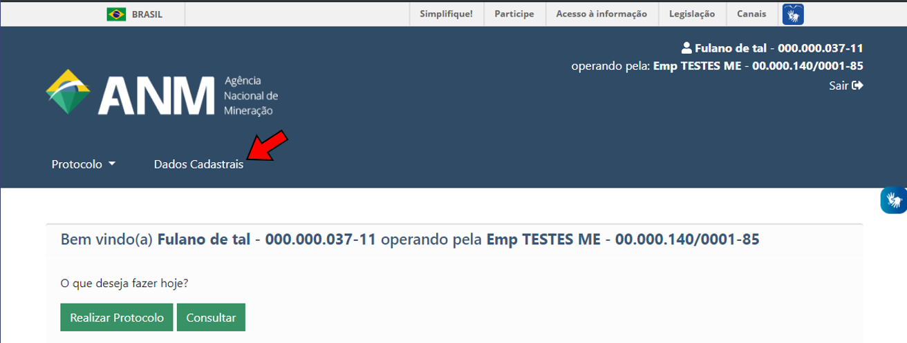
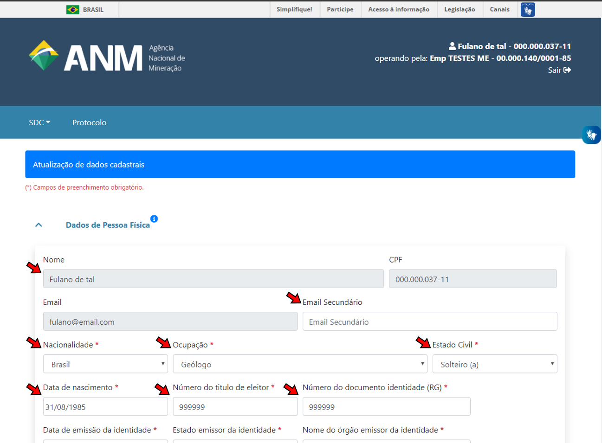
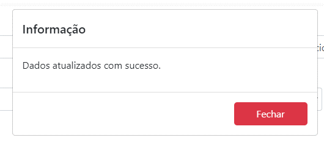

Como atualizar dados cadastrais na ANM?
=======================================

1) Uma vez logado no Protocolo Digital, acesse a aba **Dados Cadastrais** para ter acesso ao Sistema de Dados Cadastrais (SDC):

2) Na página do Sistema de Dados Cadastrais, atualize os dados cadastrais dos campos liberados para edição:

O Sistema de Dados Cadastrais possui suporte aos dados de pessoa física e jurídica. Os campos de pessoa jurídica se tornam visíveis quando o usuário estiver operando em nome de uma pessoa jurídica.

O SDC é composto pelas seguintes seções:

**Dados de Pessoa Física:**

* Dados de identificação da pessoa física
* Endereço - residencial
* Endereço - comercial
* Endereço - caixa postal

**Dados de Pessoa Jurídica:**

* Dados de identificação da pessoa jurídica
* Endereço - comercial
* Endereço - correspondência
* Endereço - caixa postal
* Quadro de Sócios Administradores

*Os campos fechados para edição (em cinza) são dados provenientes da sua conta no Login Único (acesso.gov.br)*

3) Finalize clicando em **Salvar**:

Não é mais necessário apresentar documentação referente aos dados atualizados, porém, é necessário que o interessado guarde os documentos originais para eventuais verificações.

