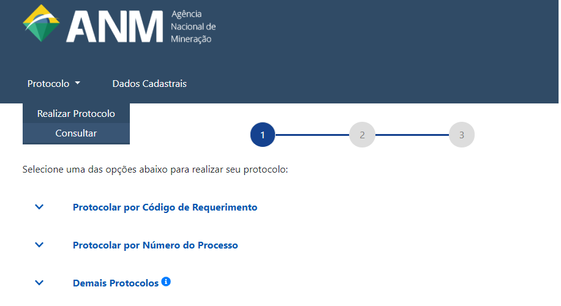
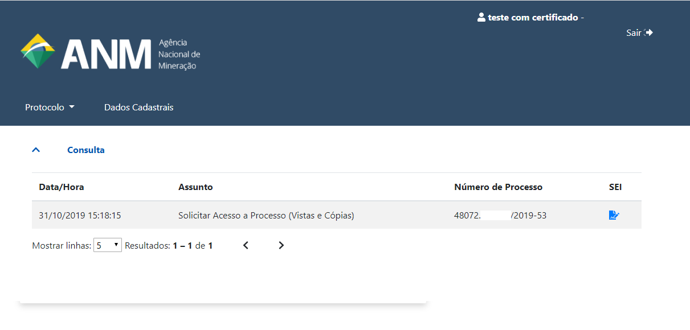
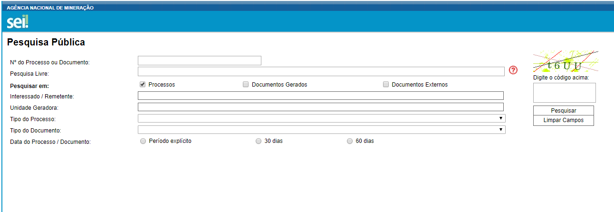

Preciso realizar cadastro no SEI? Para que serve o Peticionamento Eletrônico do SEI?
=================================================

Não há necessidade ou motivo para os usuários do Protocolo Digital realizarem cadastro no SEI!

O Peticionamento Eletrônico do SEI!, módulo criado pela ANATEL, não alimenta os sitemas especialistas da ANM.

O SEI! funciona apenas como repositório de arquivos do Protocolo Digital.

Os processos protocolizados podem ser visualizados integralmente na Consulta do Protocolo Digital:

Esta opção lista todos os processos protocolizados pelo representante:

Os documentos públicos podem ser visualizados através da `Pesquisa Pública do SEI de Processos e Documentos <https://sei.anm.gov.br/sei/modulos/pesquisa/md_pesq_processo_pesquisar.php?acao_externa=protocolo_pesquisar&acao_origem_externa=protocolo_pesquisar&id_orgao_acesso_externo=0>`_, que não exige nenhum tipo de cadastro:

O Peticionamento Eletrônico do SEI! é utilizado na ANM apenas para atender a área administrativa (contratos, licitações, pensionistas) e CNCD/CPK, que não possuem atualmente a necessidade de registro nos demais sistemas da ANM.

A utilização do Peticionamento Eletrônico do SEI! para o protocolo de documentos relacionados à área fim e atividade minerária não é permitida e eventuais protocolos realizados não serão conhecidos.
