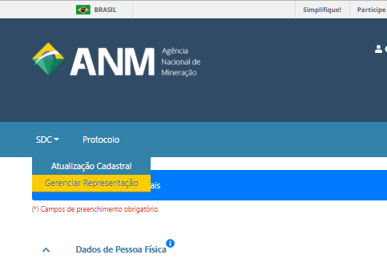
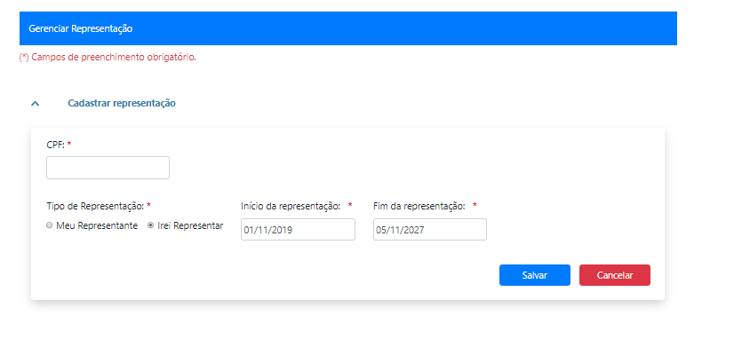

Posso acessar o Protocolo Digital em nome de outra pessoa física? Como?
=================================================================

Sim, utilizando a opção "Gerenciar Representação" no Sistema de Dados Cadastrais (SDC):

O representante e o representado podem incluir outras pessoas físicas (responsável técnico ou legal, por exemplo) para que realizem protocolos em seu nome, dentro de um determinado período, desde que estas também possuam seus respectivos cadastros prévios no SDC:

O represententante só poderá realizar protocolos em nome do representado após aprovação:

.. image:: ../imagens/listagemrepresentacao.png

A responsabilidade pelo início e término dos relacionamentos, bem como das ações realizadas durante a vigência do relacionamento, é de exclusiva responsabilidade das partes envolvidas.
