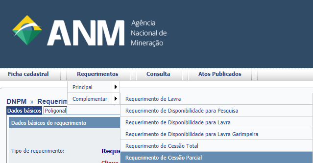
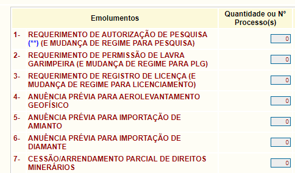

Como faço para pedir uma Cessão Parcial?
==========================================

A cessão parcial é a forma de transferir uma parte de um título ou direito minerário para outra pessoa física ou empresa.

As etapas para solicitar cessão parcial são as seguintes:

1º Acesse o Sistema Cadastro Mineiro
************************************

Selecione o Requerimento de Cessão Parcial, em Requerimentos > Complementar > Requerimento de Cessão Parcial

*Passos para acessar o pré-requerimento de cessão parcial*

Ou diretamente no site da ANM, em Assuntos > Acesso a Sistemas > `Pré-Requerimento Eletrônico <https://www.gov.br/anm/pt-br/assuntos/acesso-a-sistemas/pre-requerimento-eletronico-1>`_

2º Preencha os dados solicitados
********************************

Lembrando que o *requerente* é o *cedente*, pessoa física ou jurídica atualmente titular de todo o processo.

3º Emita e pague os emolumentos
********************************

Referentes à Cessão Parcial e ao novo título que será concedido:

*Emolumentos ANM*

* Cessão de alvará de pesquisa:

 
#. Requerimento de Autorização de Pesquisa (e mudança de regime para pesquisa)

#. Cessão/Arrendamento Parcial de Direitos Minerários

 
* Cessão de permissão de lavra garimpeira:

#. Requerimento de Permissão de Lavra Garimpeira (e mudança de regime para lavra garimpeira)

#. Cessão/Arrendamento Parcial de Direitos Minerários

* Cessão de registro de licença:

#. Requerimento de Registro de Licença (e mudança de regime para licenciamento)

#. Cessão/Arrendamento Parcial de Direitos Minerários

* Cessões de concessão de lavra, requerimento de lavra e direito de requerer a lavra:

  * Apenas o emolumento Cessão/Arrendamento Parcial de Direitos Minerários

Importante: *Lembre-se de salvar os emolumentos (boletos) gerados e os comprovantes*.

4º Acesse o Protocolo Digital
*****************************

O titular ou representante associado via Gov.BR ou senha de CTDM (válida até o final das prorrogações COVID) deverá acessar o Protocolo Digital.

O pré-requerimento gerado aparecerá na opção **Protocolar por Código de Requerimento**.

Informe o código do boleto de **Cessão parcial** gerado anteriormente.

Anexe os documentos obrigatórios e complementares necessários, incluindo os emolumentos e os comprovantes de pagamento.
 
 
