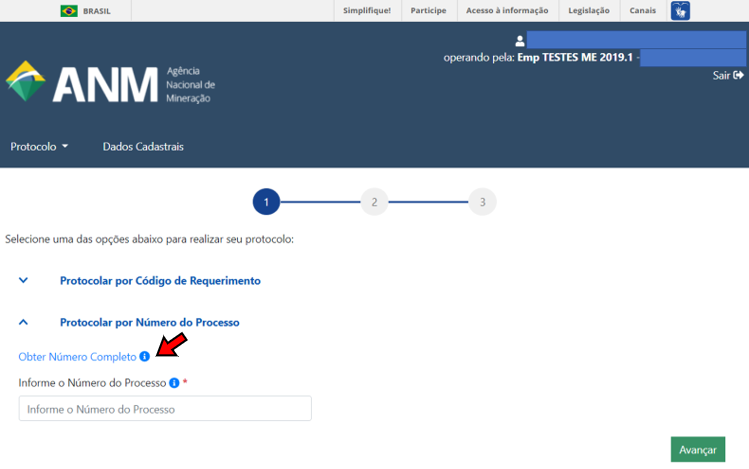
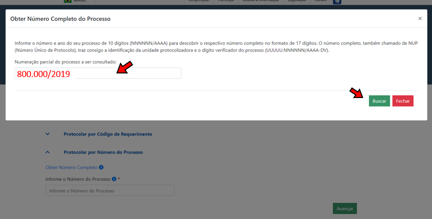
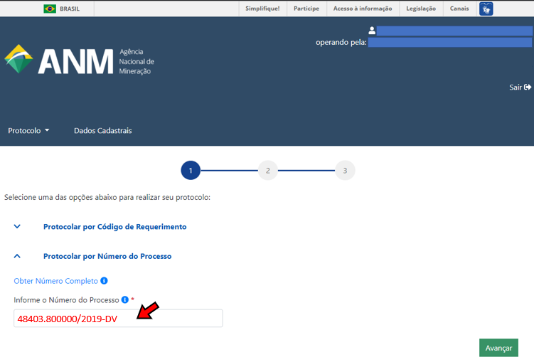
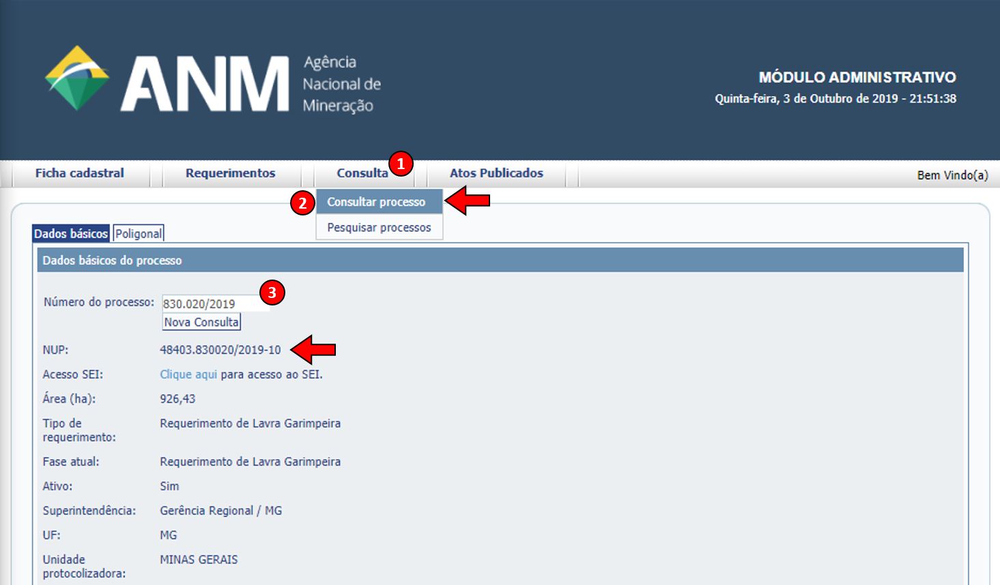

O número do processo mudou? O que é NUP?
=====================================================

O número do processo não mudou, continua sendo o mesmo, o que está mudando é apenas a forma de fazer referência a ele. 

Por muitos anos só se fazia referência aos 10 dígitos do processo, constituídos pelo "número" (000.000) e "ano" (0000) do processo. Porém, esses 10 dígitos eram apenas uma parte do número completo, que é formado por 17 dígitos e denominado por **Número Único de Protocolo (NUP)**, e é utilizado no formato **48xxx . 000000 / 2019 - DV**, sendo cada parte identificada da seguinte forma:

+-------------------------+------------------+-------+--------------------+
| Unidade Protocolizadora | Faixa sequencial | Ano   | Dígito Verificador |
+=========================+==================+=======+====================+
| 48400 (DNPM) ou         |       000000     | 2019  |        DV          |
| 48000 (ANM)             |                  |       |                    |
+-------------------------+------------------+-------+--------------------+

De agora em diante, o número de processo passará a ser usado em seu formato completo no Protocolo Digital, principalmente para **Protocolar por Número do Processo** e para realizar pesquisas no SEI.

No Protocolo Digital, na opção **"Protocolar por Número do Processo"**, é possível obter o número completo:

*a) Acessar opção Obter Número Completo*

*b) Informar a numeração parcial*

*c) Após clicar em Buscar, o NUP completo aparecerá no campo logo abaixo.*
    
    
    
No caso dos **processos minerários**, o respectivo NUP (número completo do processo) do seu processo também está disponível no Cadastro Mineiro, na tela de consulta ao respectivo processo minerário: 

.. _rst_tutorial:

* Acesse o Cadastro Mineiro, no menu *"Consulta"*, vá na opção *"Consultar Processo"*, informe os 10 dígitos do seu processo (número e ano) e, ao carregar a página de dados básicos do seu processo, o NUP estará logo abaixo do campo *"Número do Processo"*.

**Para saber mais sobre o NUP:**

    O Número Único de Protocolo (NUP) é o padrão oficial de numeração utilizada para controle dos documentos, avulsos ou processos, produzidos ou recebidos pelos órgãos e entidades da Administração Pública Federal.

    O NUP tem uma função de grande relevância, pois viabiliza a padronização na gestão documental, desde a produção ao arquivamento dos documentos, assim como facilita as comunicações entre as unidades administrativas dos órgãos e entidades ou destas com a sociedade, promovendo a simplificação do acesso às informações sobre os documentos públicos federais.
