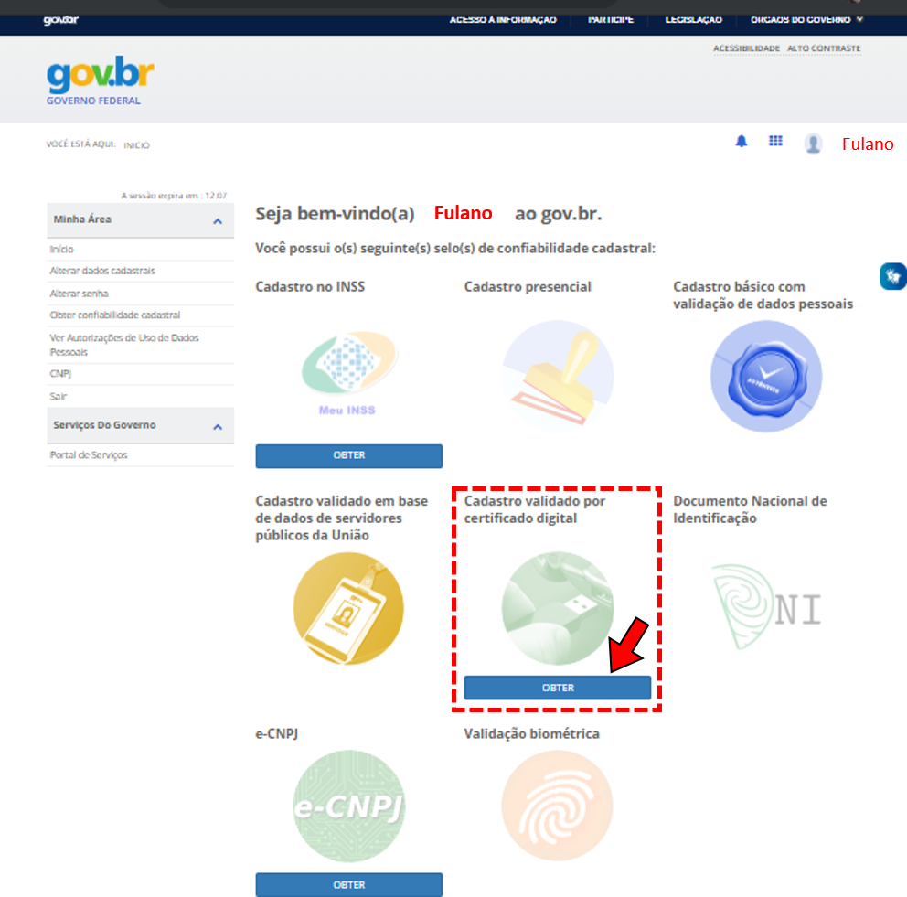
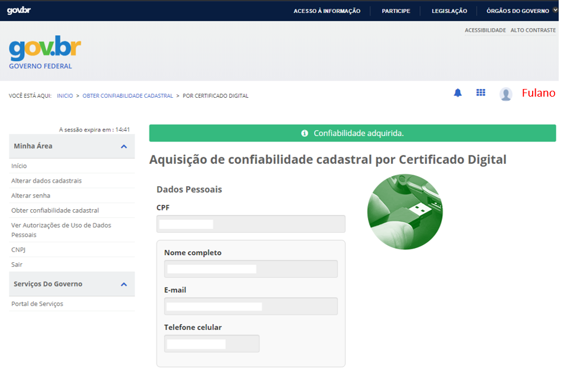

Não tenho cadastro e não tenho ficha cadastral (CTDM) protocolizada. Como devo fazer?
=================================

Passo 1 
**********************
            Acesse https://acesso.gov.br/
            Crie sua conta no Login Único

Passo 2
**********************
          Obtenha os selos e-CPF **ou** e-CNPJ, conforme o caso, a partir do respectivo certificado digital.

e-CPF 
+++++++++++++++++++++
Na página de gerenciamento do Login Único, no selo **“Cadastro validado por certificado digital”** clique em **obter** e siga as instruções.

*Clique no selo "cadastro validado por certificado digital"*

*Confira os dados e confirme a aquisição de confiabiliade com base no e-CPF*

No momento da aquisição do selo e-CPF você deverá estar com o *token* (*pen drive*) conectado ao computador ou certificado instalado. Certificados do tipo A1 e A3.

e-CNPJ
+++++++++++++++++++++
Na página de gerenciamento do Login Único, **clique em obter confiabilidade no “e-CNPJ”** e siga as instruções.

.. image:: http://faq-login-unico.servicos.gov.br/en/latest/_images/telainicialcomocadastrarCNPJ.jpg

No momento da aquisição do selo e-CNPJ você deverá estar com o *token* (*pen drive*) conectado ao computador ou certificado instalado. Certificados do tipo A1 e A3.

Mais informações sobre o Login Único podem ser obtidas no respectivo FAQ: https://faq-login-unico.servicos.gov.br/en/latest/

Passo 3
**********************
Cadastre-se na ANM
          
          Acesse o Protocolo Digital: http://www.anm.gov.br/novo-protocolo/inicio-protocolo
          
          .. image:: ../imagens/Telaprotocolodigital.PNG
          
          No primeiro acesso, preencha os dados cadastrais.
          
          Após o preenchimento, o CPF ou CNPJ estará disponível para realização de requerimentos e pedidos de serviços.
          
          

