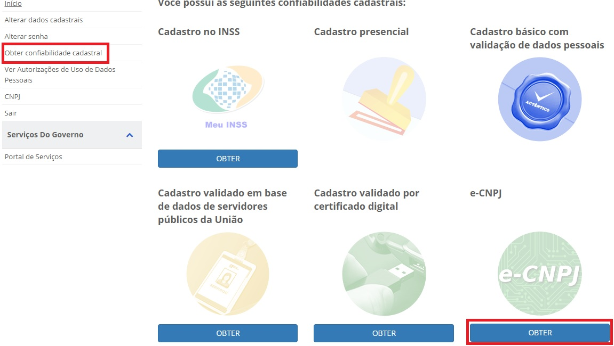

Tenho certificado digital e-CPF ou e-CNPJ, mas não aparece no Gov.BR
==========================================================================

e-CPF 
**********************

Na página de gerenciamento do Gov.BR, no selo **“Cadastro validado por certificado digital”** clique em **obter** e siga as instruções.

.. image:: ../imagens/validarPorECPF_01.png
*Clique no selo "cadastro validado por certificado digital"*

.. image:: ../imagens/validarPorECPF_02.png
*Confira os dados e confirme a aquisição de confiabiliade com base no e-CPF*

No momento da aquisição do selo e-CPF você deverá estar com o *token* (*pen drive*) conectado ao computador ou certificado instalado. 

Certificados do tipo A1 e A3.

e-CNPJ
**********************
Na página de gerenciamento do Gov.BR, **clique em obter confiabilidade no “e-CNPJ”** e siga as instruções.

http://faq-login-unico.servicos.gov.br/en/latest/_perguntasdafaq/comoadquirircertificadodigitalpessoajuridica.html 

No momento da aquisição do selo e-CNPJ você deverá estar com o *token* (*pen drive*) conectado ao computador ou certificado instalado. 

Certificados do tipo A1 e A3.

Mais informações sobre o Gov.BR podem ser obtidas no respectivo FAQ: https://faq-login-unico.servicos.gov.br/en/latest/
