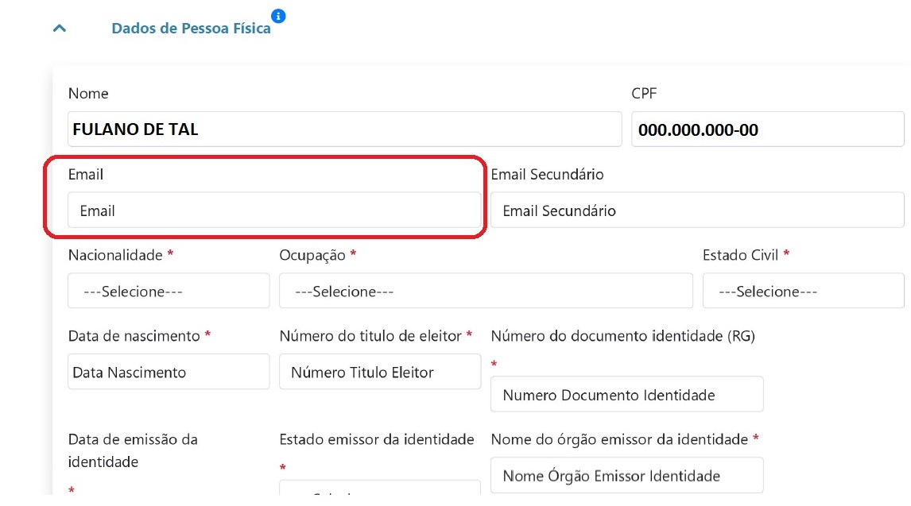
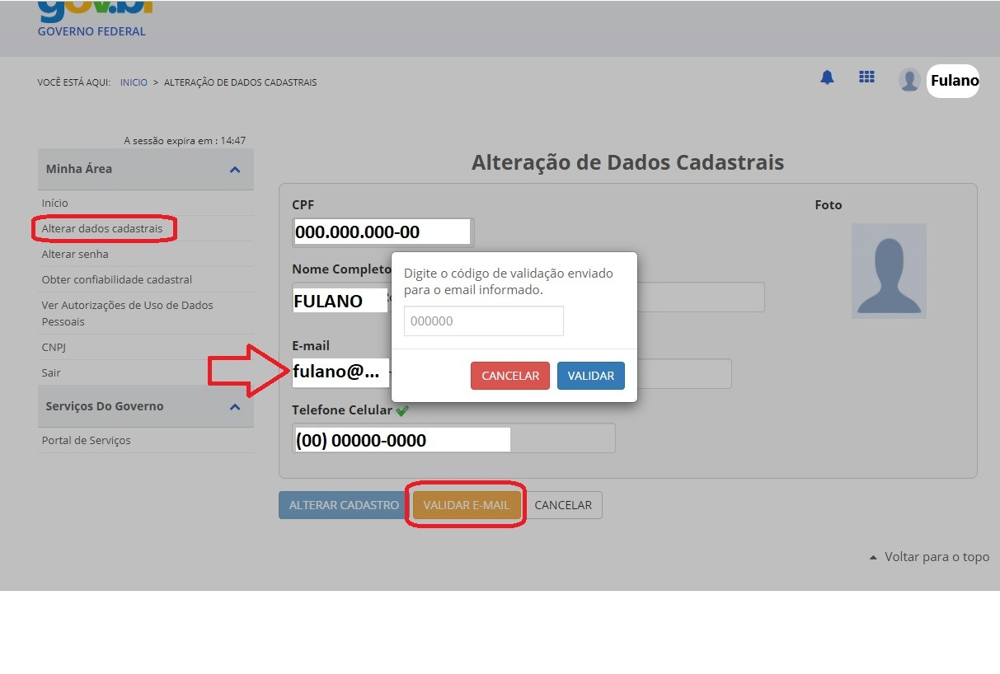

Meu campo de e-mail não vem preenchido no SDC e não consigo prosseguir. Como proceder?
======================================================================================

O e-mail principal do Sistema de Dados Cadastrais (SDC) é preenchido de acordo com o e-mail que está **cadastrado e VALIDADO** na conta do Login Único.

Nesse caso, acesse novamente sua conta no Login Único (https://acesso.gov.br/) e verifique se consta algum e-mail vinculado à sua conta. Se não tiver e-mail vinculado, informe seu e-mail e valide. Se tiver algum e-mail informado, verifique se o mesmo já foi validado perante o Login Único. **Lembre-se de verificar o spam ou a lixeira de seu e-mail, caso esse e-mail de validação não chegue à caixa de entrada.**

Depois de validar seu e-mail no Login Único, acesse novamente o Sistema de Dados Cadastrais, que o referido e-mail irá aparecer na página de cadastro da ANM para o Protocolo Digital. 
