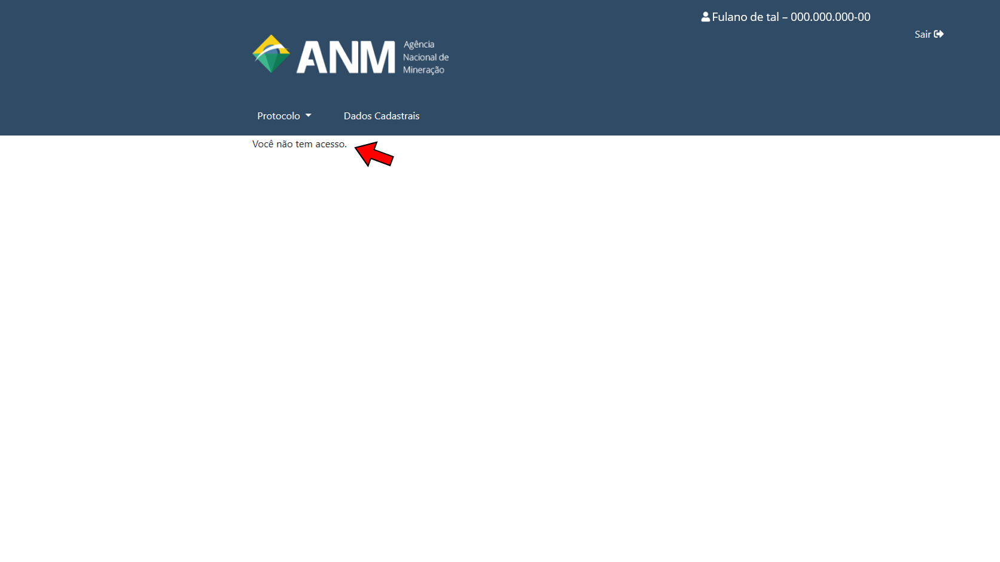

O que fazer quando ocorre o erro 'Você não tem acesso'?
=======================================================

Caso ocorra o erro **Você não tem acesso**

Causas mais comuns: 

Acessar o sistema pelo link incorreto
**********************************

.. image:: ../imagens/acessogov.br.jpg

Neste caso, basta acessar o sistema pelo link correto. Caso o erro persista, feche todos os seus navegadores de internet e abra uma nova janela.

Conta sem as qualificações mínimas de autenticação
************************************

Neste caso, a pessoa física que está tentando acesso nunca teve ficha cadastral na ANM e sua conta do Login Único não está associada a um certificado digital.

* Caso não possua certificado digital, siga as instruções disponíveis em:
https://anm.readthedocs.io/en/latest/_perguntasfaq/3.6NaoTenhoCertificadoDigital.html

* Caso já possua certificado digital, siga o passo a passo disponível em:
https://anm.readthedocs.io/en/latest/_perguntasfaq/9.12tenhocertificadonaoaparece.html
